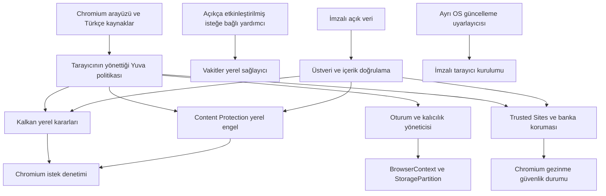

# Yuva mimarisi

Durum: 18 Eylül 2026 tarihli Faz 0 önerisi. Bileşenler henüz uygulanmadı. Asıl mimari bu dosyadadır; [docs/ARCHITECTURE.md](docs/ARCHITECTURE.md) buraya yönlendirir.

Chromium tarayıcı arayüzü, Blink, V8, ağ katmanı, PDFium, eklenti altyapısı ve OS güvenlik bütünleşmesi korunur. `yuva/` bileşenleri küçük, sahipli yamalarla bağlanır. Tarayıcı bütünleşmesi C++, sınırlandırılmış IPC Chromium Mojo; ayrık ayrıştırıcı/eşleştirici için uygun olduğunda Rust kullanılır. İkinci render soyutlaması veya JavaScript masaüstü kabuğu kurulmaz.

## Bileşenler ve yetki sınırları

Aşağıdaki adlar önerilen Yuva sözleşmeleridir; var olan Chromium API'si oldukları iddia edilmez.

| Bileşen | Girdi/çıktı | Sınır |
| --- | --- | --- |
| `yuva/browser/policy/` | Yerel tercih → nesil kimlikli değişmez politika | Sayfa korumayı, kalıcılığı veya izni değiştiremez |
| `yuva/components/kalkan/` | İstek bağlamı + kurallar → izin/engel/temizlenmiş gezinme | Yerel, sınırlı eşleştirme; URL sorgu servisi yok |
| `yuva/browser/storage/` | Kullanıcı eylemi + oturum → depolama yaşam döngüsü | Süreç/depolama atamasından önce seçim; canlı belge yeniden bağlanmaz |
| `yuva/components/trusted_sites/` | Kanonik URL + kayıt + güvenlik durumu → etiket/uyarı | TLS'i aşamaz, kök sertifika ekleyemez |
| `yuva/components/bank_security/` | Doğrulanmış banka origin'i → hassas gezinme bağlamı | MFA/form akışını sessiz değiştiremez |
| `yuva/components/content_protection/` | Kanonik host + imzalı indeks → yerel politika engeli | Ayrı kök; ziyaret denemesi kaydı/URL sorgusu yok |
| `yuva/components/privacy_signals/` | Kullanıcının mahremiyet tercihi → GPC/DNT | Rıza uydurmaz; HTTP/DOM/worker tutarlılığı |
| `yuva/optional/prayer_times/` | Açık etkinleştirme + elle şehir → vakit bilgisi | Varsayılan kapalı; din/konum çıkarımı yok |
| `yuva/components/component_security/` | İndirilen veri → doğrulanmış değişmez görüntü | Boyut, imza, süre ve sürüm gerileme kontrolleri |
| `yuva/browser/ui/` | Tarayıcı durumu → küçük kalkan | Sayfaya açık doğrulama rozeti API'si yok |
| `yuva/browser/search/` | Sorgu + seçilen sağlayıcı → doğrudan istek | Yuva aracı sunucusu yok |
| `yuva/updater/` | Yetkilendirilmiş hedef → hazırlanmış OS kurulumu | İçerikten keyfi URL/komut kabul etmez |

İndirilen kurallar istek yolunun dışında, sandbox içindeki yardımcı süreçte derlenir. Denetim, Chromium istek işleme katmanına yakın salt okunur sınırlı eşleştiriciyle yapılır. Tek URLLoader kancası worker, yönlendirme, WebSocket ve prerender kapsamının kanıtı değildir; kilitli revizyonda yollar izlenmelidir.

## Veri modeli ve değişmezler

Kalıcı kontrol durumu; ayarlar, açıkça kaydedilen yer imleri, bileşen sürümleri, güncelleme güveni ve bilinçli izinlerdir. Geçici web verisinden ayrılır. Kontrol durumu da hatırlanan siteleri açığa çıkarabilir; kendiliğinden şifreli veya anonim değildir.

Kalkan varsayılan `standard` ile takipçileri engeller; takip yapmayan normal reklam genel reklam kuralıyla engellenmez. `strict` reklam engellemeyi ekler; siteye özel `off` yalnız takip/reklam filtrelerini etkiler. Üçüncü taraf çerez/partition, TLS, genel tehdit, banka/kamu ve zorunlu içerik korumasını kapatamaz. Kendi reklamı ve ücretli allowlist yasaktır. [Politika ayrıntısı](PRIVACY_ARCHITECTURE.md).

0.1 için tüm normal web pencereleri, denetlenmiş ana ayar profili yanında Chromium'un mevcut off-the-record depolamasına yönlendirilir. Ana profil normal web içeriği barındırmaz. Tek ürün gezinme modu vardır. Açılış bağlantısı, popup, otomasyon veya eklenti sessizce kalıcı gezinme açamaz. Hatırlama ertelenir; [mahremiyet tasarımı](PRIVACY_ARCHITECTURE.md).

Sandbox, site/süreç yalıtımı, origin denetimi, CSP/CORS/COOP/COEP, sertifika doğrulaması ve istismar azaltımları korunur. Kök güven, iptal, CT ve HSTS yenilemesi sürdürülür. Her güvenlik değişikliği uygulanmadan [özellik kaydına](docs/SECURITY_FEATURE_REGISTER.md) girer.

README'nin güncel karar sırası güvenlik, gizlilik, sürdürülebilirlik, uyumluluk, sadelik ve özelliklerdir. Chromium güvenlik güncellemelerini hızlı ve sürdürülebilir alma, güvenliğin önkoşuludur; özellik uğruna ertelenemez.

## Hizmet bağımlılıkları

| Sınıf | Politika |
| --- | --- |
| Yuva analitiği/çökme yüklemesi | Başlangıçta yok |
| Google hesabı/senkronizasyon ve ilgisiz ürün hizmetleri | Dar biçimde kaldır; Yuva hesabıyla değiştirme |
| Arama önerisi/tahmin/önceden bağlantı | Başlangıçta kapalı |
| Yazım/çeviri | Yerel yazım denetimi; varsayılan uzak metin yüklemesi yok; çeviri ertelenir |
| Uzak deneyler | Keyfi uzak davranış değişikliği yok; güvenlik ayarları korunarak sabit yapılandırma |
| Tehdit istihbaratı | Çalışan arka uç ve veri akışı incelemesi herkese açık ikili önkoşulu |
| Kök/iptal/CT bileşenleri | Uçlar kaldırılmadan doğrulanmış güncelleme yolu korunur/değiştirilir |
| Eklentiler | Açık kurulum, doğrulanmış güncelleme; Faz 1 mağaza yok |
| DRM/codec | Dağıtım hakkı ve uyumluluk varsayılmaz |
| Bağlantı kontrolü/konum/push/DNS | Gerçek uç ve veriyi çıkar; gereksiz çağrıları kapat |

Safe Browsing adayı: uygunluk/koşullar ve gerçek bütünleşme doğrulanırsa yerel liste/hash öneki, bağımsız OHTTP aktarıcısıyla değerlendirilebilir. Hash öneki bilgi sızdırabilir; aktarıcı işbirliği kalan risktir. Alternatifin oltalama/zararlı yazılım güncelliği ve indirme kapsamı ölçülmelidir. Trusted Sites ve takip listeleri yerine geçmez. Kabul edilebilir çalışan arka uç yoksa herkese açık 0.1 ikilisi yayımlanmaz. [Safe Browsing v5](https://developers.google.com/safe-browsing/reference?authuser=117).

Gereksiz özel Microsoft, Apple veya Google hizmet bağımlılıkları eklenmez. Güvenlik/imzalama, sandbox, anahtarlık/kimlik bilgisi deposu, bildirim ve zorunlu yerel OS bütünleşmesi istisna olabilir; amaç, ağ/veri etkisi, OS kapsamı ve alternatifler kaydedilir. Zorunlu Windows SDK veya macOS noter onayı, tüm kullanıcılara bulut hesabı zorunluluğunu haklı çıkarmaz.

## Arama ve eklentiler

Chromium sağlayıcı modeli kullanılır: İngilizce sabit kimlik, yerelleştirilmiş ad, doğrulanmış HTTPS sorgu şablonu, kodlama, varsayılan kapalı öneri ucu. İlk aramadan önce seçim sunulur; URL ile gezinme seçimsiz çalışır. Sorgu doğrudan sağlayıcıya gider; Yuva yönlendirmesi veya sponsor sıralaması yoktur.

Mümkün olduğunda MV3 API'leri, izin uyarıları, site bazlı host erişimi, imza denetimi ve devre dışı bırakma korunur. MV3 güvenilirlik garantisi değildir; eklentiler kullanıcıyı tanıyabilir. [MV3 belgesi](https://developer.chrome.com/docs/extensions/develop/migrate/what-is-mv3).

Chrome Web Store politikası/güncellemesi ayrıca denenir; keyfi CRX yükleyerek uyumluluk iddia edilmez. 0.1 hazır eklenti içermez, yalnız geliştirici senaryoları sınanır. OTR'de split/spanning ve izin davranışı incelenmelidir; eklenti ana profile yazabilir veya gezinmeyi gönderebilir. Otomatik gizli-oturum yetkisi verilmez.

## Dil, arayüz ve platformlar

[Tasarım sistemi](docs/DESIGN_SYSTEM.md) ve [bağımsız envanter](docs/DESIGN_COMPONENTS.html) önkoşuldur. Nötr chrome, tek mavi vurgu, native davranış; `system`/`light`/`dark` varsayılan Sistem ve canlı tema takibi. Güvenlik metin+ikon+renkle, bütün platformlarda erişilebilir olmalıdır.

Sekmeler, adres/arama çubuğu, geri/ileri/yenile, indirmeler, ayarlar ve küçük kalkan yeterlidir. Ağır tasarım değişikliği yoktur. [Dil politikası](docs/LANGUAGE_POLICY.md) zorunludur: kod/parametre İngilizce, yorum/belge Türkçe, arayüz Türkçe. GRIT/GRD ve İngilizce mesaj kimlikleri kullanılır. Türkçe casing, ekran okuyucu, kesilme ve bidi test edilir; alan adı kıyası yerel dil dönüşümünden bağımsızdır.

Hedefler: Windows x86_64; macOS ARM64/x86_64; genel Linux x86_64; **ayrı birinci sınıf Pardus x86_64**. Desteklenen Pardus kollarına açık derleme/test işleri ve yerel `.deb` gerekir. [Pardus planı](docs/PARDUS_SUPPORT.md) güncel matrisi belirler. Dört platform ailesinin bütün gerekli işleri geçmeden masaüstüne hazır yayın olmaz.

Android masaüstü kararlılığından sonra ayrı Chromium koludur. iOS ayrı fizibilite ister; Türkiye'de alternatif motor yetkisi varsayılmaz, uygulanabilir kurallar izin vermedikçe WebKit istemcisi planlanır. [Apple gereksinimleri](https://developer.apple.com/support/alternative-browser-engines/).

İlk inceleme doğrudan upstream yaklaşımı, ekip, 0.1 sınırı ve Pardus kapısını kabul eder. Sonraki sınırlı deneyler tehdit hizmeti, imzalama, geçici profil yazıları, eklentiler, yerel engelleme ve seçici kalıcılığı çözer. Hiçbiri henüz çalışır özellik sayılmaz.

## Zorunlu yayın güvenliği ve isteğe bağlı sınır

[Trusted Sites/Banking Registry](TRUSTED_SITES_DESIGN.md) kapsamı BDDK ve resmî kamu dizinleriyle doğrulanır. Çok sinyalli benzer adres kesintisi yereldir; kullanıcıya sade Türkçe ve güvenli resmî hedef/geri eylemi verir. Bank Security Mode temel origin bağlamına dayanır; eklenti/pano gibi derin müdahaleler ayrıca tasarım ve MFA testi ister.

[Content Protection](CONTENT_PROTECTION.md) bilinen yetişkin siteler için ayrı lisanslı, imzalı, çevrimdışı negatif listedir. Resmî dağıtımda zorunludur; Kalkan veya Hatırla bunun yetkisini değiştiremez. Liste/kurum kaydı tarayıcı içine elle domain dizisi olarak yazılmaz. Sayfa sınıflandırması Yuva'ya gönderilmez.

Bütün zorunlu banka/kamu/oltalama/içerik ve genel güvenlik kapıları resmî 0.1 ikilisi için de geçerlidir. Yerel fixture/geliştirme çalışması resmî dağıtımla karıştırılmaz. Yüksek güvenlik kapsamının küçük ekibe veri doğrulama ve olay müdahalesi yükü eklediği kapasite planına dahil edilir.

[Vakitler](docs/OPTIONAL_FEATURES.md) sonraki aşamada varsayılan kapalı, küçük bir yardımcı olabilir. Tarayıcı dinî/siyasi tarafsızdır; ülke/dil/IP veya Ramazan özellik etkinleştiremez. Yerel şehir/yöntem seçimi ve değiştirilebilir sağlayıcı güvenlik çekirdeğinden ayrıdır. Dinî içerik portalı ve otomatik ses yoktur.
